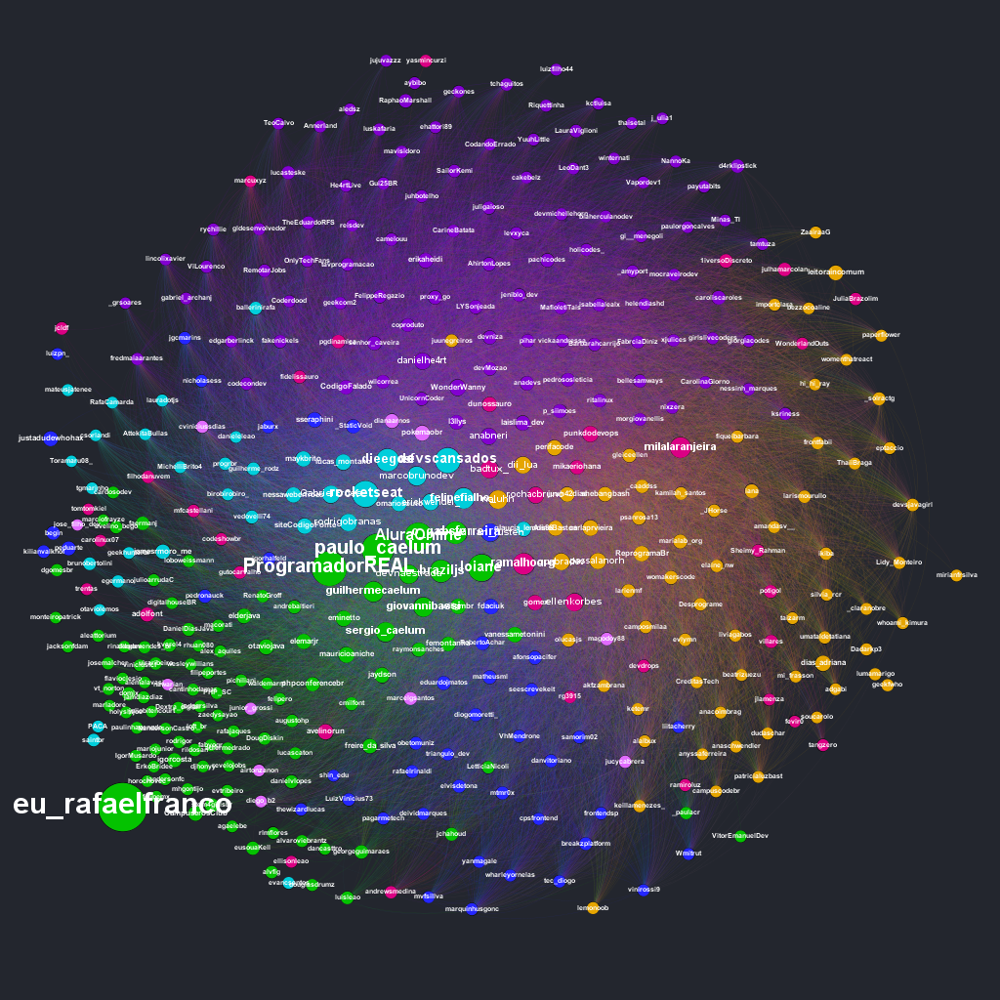

# Dev Communities

This repository contains the work I did to map out and create data visualizations of the communities around creators of tech content in Portuguese.
So far there are two viusualizations that resulted from this work, one for Twitter communities and another one for Twitch live-coding communities.

The complete zoomable SVG of these visualizations are available in the following links: [Twitch](https://gazeta.dev/comunidades/twitch), [Twitter](https://gazeta.dev/comunidades/twitter).

## Twitch Portuguese Speaking Live-coders

## Twitter Portuguese Speaking tech content creators

## What's in the repository

The repository contains the raw data that was collected as well as the scripts that were used to collect and process it. Feel free to use the data and scripts as you please.

### Collecting Data

The methods for collecting data for each visualization differ a lot from each other. The scripts used are under the `data-mining` folder of each respective visualization.

### Visualizing

The above visualizations were created using a Graph visualization tool called [Gephi](https://gephi.org/).
Gephi needs a specific file format for both nodes and edges, the script on `shared/PrepareForGephi.py` processes a CSV containing accounts in the headers and their respective followers/watchers/etc in the cells. The script outputs two different files that can be imported by Gephi as nodes and edges.

The positioning of the nodes above is defined using a Force Atlas algorithm and the colors of the nodes are defined using the Modularity analyis of Gephi. The parameters for these differ on each visualization and are the result of playing with the tool until a nice and meaningful visualization appears.

## Credits

Both the idea and part of the code on this repository were inspired by a work done by Kiran Gershenfeld. He was the first one to apply this visualization to Twitch communities and these visualizations are merely a replication of his concept using a more specific niche (Portuguese speaking developers). He wrote a [very nice article about his work on Towards Data Science](https://towardsdatascience.com/insights-from-visualizing-public-data-on-twitch-a73304a1b3eb). I strongly recommend reading it. The repository for his work is the following: https://github.com/KiranGershenfeld/VisualizingTwitchCommunities.
